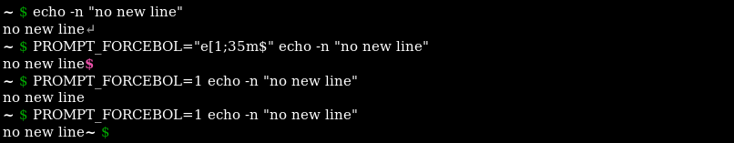

## Look

Minimal:


With many features:


Also good readable on light background:


## Features

**Return code.** If the return code is not 0, the prompt sign switches to red and the return code is shown:


**Background jobs.** The number of jobs in the background are shown inside brackets at the end of the path:

![~[1] $](images/bg.png)

**Directory rights.** An additional colored slash will be shown at the end of the path on some circumstances.
Red means it is readonly, yellow it is writeable for everyone.


**Path trimming.** Only the two trailing path components are shown by default. This can be changed by setting `PROMPT_DIRTRIM=n`.


**Symlink detection.** The prompt detects if you follow a symlink and change the color from this path component to gray:


**Work bases.** It is possible to define work bases using `PROMPT_BASES="name1=path1:name2=path2:…"`. If you are below of one of these pathes the base will be replaced by its name (displayed underlined) and the path is shown relative to it.


**Repository.** Inside a GIT or SVN repository it shows the current branch respectively the revision and a star if there are uncommited changes.
This feature can be adjusted by the variable `PROMPT_REPOS` (0, git, svn).


**Subshell.** If the current bash is running inside one of screen, tmux, script(1), chroot(1), [vcsh](https://github.com/RichiH/vcsh/), or another bash, this will be shown on the beginning of the prompt. Each of them can be ignored by putting it to the `PROMPT_IGNORE` environment variable.


**User switching.** The username will be shown if you switched the user since login. It will also shown in red color if you are root.
The username can be forced on or off by setting `PROMPT_USER`.


**Host.** The host name is only visible on remote hosts, but can be forced by setting `PROMPT_HOST=1`.


**X11 forwarding.** If `DISPLAY` variable is set, this will be shown by a green `@` before the host part.


**Force begin of line**. If the cursor is not on the first column, a gray `↵` is printed and the prompt starts on new line.



`PROMPT_FORCEBOL=0` disables this behavior. The printed sign can be changed by `PROMPT_FORCEBOL=string`. With `PROMPT_FORCEBOL=1` no sign will be printed.


## Use
Copy `bash_prompt.sh` to e.g. `~/.bash_prompt` and source it with
```bash
source ~/.bash_prompt
```

If you want to use it in all new shells, add it to your `.bashrc`, e.g.
```bash
[ -f ~/.bash_prompt ] && source ~/.bash_prompt
```

If you want to install it for all users on the system, copy `bash_prompt.sh` to
* `/etc/bash/bashrc.d/` (e.g. on Gentoo)
* `/etc/profile.d/` (e.g. on Debian and Ubuntu)

## Color scheme
The script contains a color sheme for 256 color terminals as well as a fallback scheme for terminals which support just 16 colors.
To get the color numbers of your actual TERM, use:
```bash
$ tput colors
256
```
To enable 256 color capabilities on your terminal, add following to your `.bashrc`:
```bash
case "$TERM" in
  'xterm') TERM=xterm-256color;;
  'screen') TERM=screen-256color;;
  'Eterm') TERM=Eterm-256color;;
esac
export TERM

if [ -n "$TERMCAP" ] && [ "$TERM" = "screen-256color" ]; then
  TERMCAP=$(echo "$TERMCAP" | sed -e 's/Co#8/Co#256/g')
  export TERMCAP
fi
```
See https://fedoraproject.org/wiki/Features/256_Color_Terminals

### Customization
The color scheme can be customized by the `PROMPT_COLORS` environment variable. The variable has the form
```bash
PROMPT_COLORS="keyword1=color1:keyword2=color2:..."
```
Valid keywords are:
```
host user root path jobs display symlink sign errsign errno readonly unsafe repos changes term base
```
Colors are defined by [ANSI color sequences](https://en.wikipedia.org/wiki/ANSI_escape_code#Colors).

Example:
```bash
export PROMPT_COLORS="path=1;30:sign=1;33"
```

## Alternatives

* [Liquid prompt](https://github.com/nojhan/liquidprompt)
* [Powerline](https://github.com/powerline/powerline)
